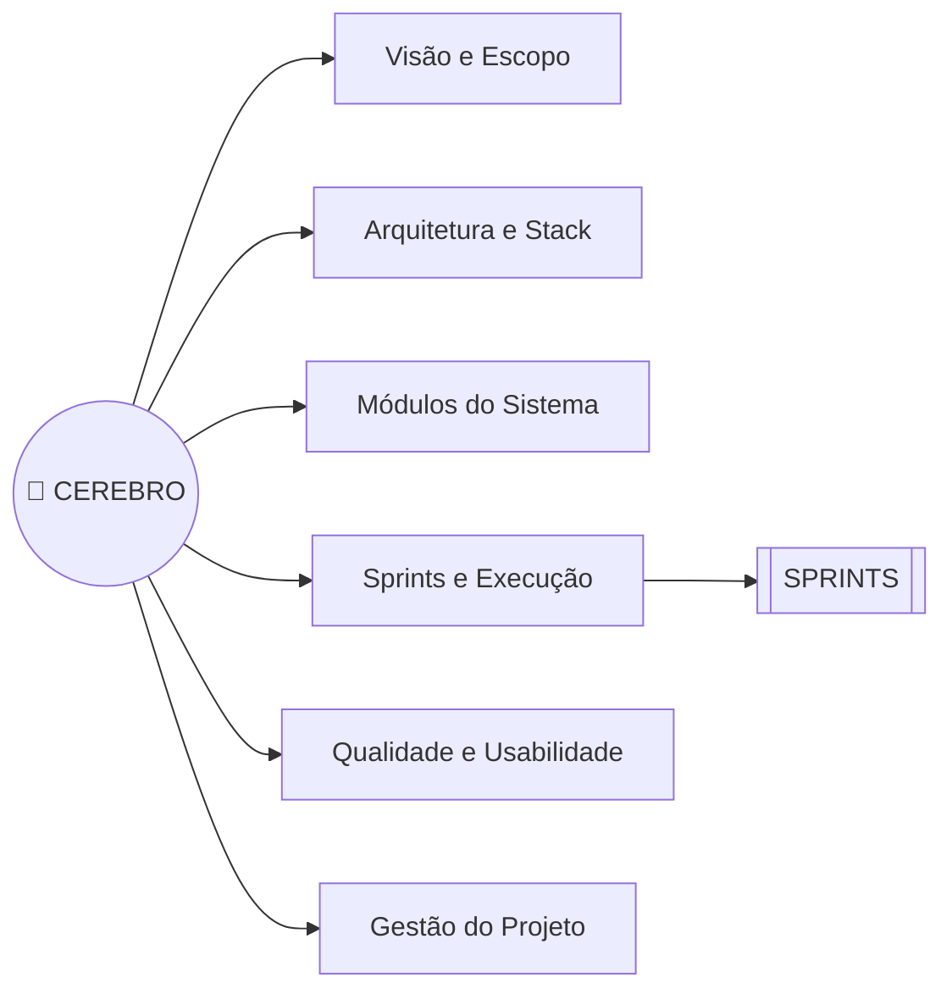

# 🧠 CEREBRO — Gestão de Laboratório

> **Arquivo-cérebro do projeto:** ponto único de navegação do conhecimento, organizado por
> **wikilinks** (`[[Nota]]`). Abra este vault no Obsidian (ou editor compatível) e navegue
> clicando nos links. Notas ainda não criadas aparecem como pendências — crie-as conforme o
> projeto evolui.
>
> ▶️ Execução prática: **[[SPRINTS]]**

## Mapa do cérebro

---

## 1. Visão e escopo

- [[Visao do Produto]] — problema, proposta de valor e critérios de sucesso
- [[Premissas do Escopo]] — decisões assumidas que precisam de validação
- [[Stakeholders]] — coordenação, técnicos, docentes, alunos e TI
- [[Personas]] — aluno, docente, técnico e gestor
- [[Requisitos do Produto]] — requisitos funcionais e não funcionais
- [[Glossario]] — termos do domínio (reserva, chamado, lote, calibração…)

## 2. Arquitetura e stack

- [[Arquitetura]] — visão de módulos, dados e integrações
- [[Stack Tecnica]] — TypeScript, React, Vite, Tailwind, shadcn/ui, Convex
- [[Estrutura de Pastas]] — organização por módulos (resumo também em [[SPRINTS]] §3)
- [[Convencoes de Codigo]] — lint, nomenclatura e commits
- Design system: [[stitch_portal_de_carreiras_unicap/academic_prestige_modern/DESIGN|Academic Prestige Modern]] ([DESIGN.md](stitch_portal_de_carreiras_unicap/academic_prestige_modern/DESIGN.md))

## 3. Módulos do sistema (uma nota por módulo)

[[Modulo Auth]] · [[Modulo Dashboard]] · [[Modulo Laboratorios]] · [[Modulo Equipamentos]] · [[Modulo Reservas]] · [[Modulo Insumos]] · [[Modulo Manutencao]] · [[Modulo Usuarios]] · [[Modulo Relatorios]]

> Cada nota de módulo documenta: **Objetivo → Entidades → Regras de negócio → Telas → API (funções Convex) → Testes → Pendências**.

## 4. Sprints e execução

- Plano completo: **[[SPRINTS]]**
- [[Roadmap]] — marcos por trimestre
- [[Backlog do Produto]] — histórias priorizadas
- Sprints: [[Sprint 0]] · [[Sprint 1]] · [[Sprint 2]] · [[Sprint 3]] · [[Sprint 4]] · [[Sprint 5]] · [[Sprint 6]] · [[Sprint 7]] · [[Sprint 8]]

## 5. Qualidade e usabilidade

- [[Plano de Qualidade]] — estratégia geral de QA
- [[Piramide de Testes]] — unitário → integração → E2E
- [[Plano de Testes por Modulo]] — casos de teste por módulo
- [[Criterios de Aceite]] · [[Definition of Done]]
- [[Bug Triage]] — severidades e SLA
- [[Auditoria de Acessibilidade]] — WCAG 2.1 AA
- [[Plano de Usabilidade]] · [[Roteiro de Usabilidade]] · [[Metricas SUS]]

## 6. Gestão do projeto

- [[Rituais Ageis]] — planning, daily, review e retrospectiva
- [[Quadro Kanban]] — colunas e limite de WIP
- [[Metricas do Time]] — velocity, burndown, lead time
- [[Riscos e Mitigacoes]] — registro vivo de riscos
- [[ADRs]] — decisões de arquitetura numeradas
- [[Atas de Reuniao]] — decisões e encaminhamentos

---

## 7. Estado atual

| Campo | Valor |
|---|---|
| Fase | Planejamento (pré-Sprint 0) |
| Sprint atual | — |
| Próxima ação | Validar [[Premissas do Escopo]] com os [[Stakeholders]] |
| Riscos ativos | Ver [[Riscos e Mitigacoes]] |
| Última atualização | 2026-09-10 |

## 8. Decisões já tomadas (resumo de [[ADRs]])

| ADR | Decisão | Motivo |
|---|---|---|
| ADR-001 | TypeScript `strict` + React + Vite | Segurança de tipos e produtividade |
| ADR-002 | Backend em Convex | Dados e funções reativos sem servidor próprio |
| ADR-003 | Código organizado por módulos (feature-first) | Manutenção isolada e testes por domínio |
| ADR-004 | Design system "Academic Prestige Modern" | Identidade institucional já definida em DESIGN.md |

## 9. Convenções do vault

- **Uma ideia = uma nota**, com nome curto e descritivo (sem acentos nos nomes de arquivo).
- Toda nota nova deve ser **linkada daqui** — senão ela "morre" fora do grafo.
- Notas de módulo seguem o molde da seção 3.
- Atualize a seção **Estado atual** ao final de cada sprint.
